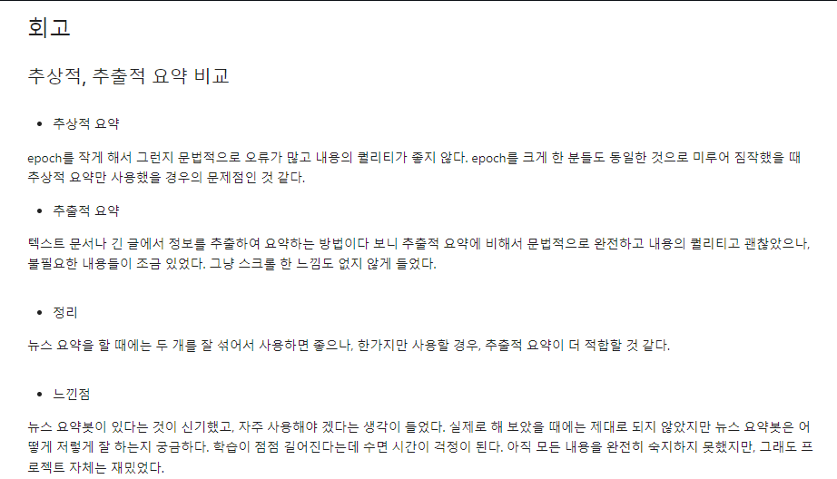

# AIFFEL Campus Online Code Peer Review Templete
- 코더 : Lim Jeong Hun
- 리뷰어 : 김민규


# PRT(Peer Review Template)
- [x]  **1. 주어진 문제를 해결하는 완성된 코드가 제출되었나요?**
    - 평가문항
        - 1. Abstractive 모델 구성을 위한 텍스트 전처리 단계가 체계적으로 진행되었다. (o)   
          
        - 2. 텍스트 요약모델이 성공적으로 학습되었음을 확인하였다. (x)
        - 3. Extractive 요약을 시도해 보고 Abstractive 요약 결과과 함께 비교해 보았다. (x)
            
- [x]  **2. 전체 코드에서 가장 핵심적이거나 가장 복잡하고 이해하기 어려운 부분에 작성된 
주석 또는 doc string을 보고 해당 코드가 잘 이해되었나요?**
    
    > 특정 파라미터 값을 왜 이렇게 정했는지 주석을 달면 더 좋을 것 같습니다!
        
- [x]  **3. 에러가 난 부분을 디버깅하여 문제를 “해결한 기록을 남겼거나” 
”새로운 시도 또는 추가 실험을 수행”해봤나요?**
    

        
- [x]  **4. 회고를 잘 작성했나요?**
    

- [x]  **5. 코드가 간결하고 효율적인가요?**
    
    > 실험 과정을 for 문으로 깔끔하게 진행했습니다

# 참고 링크 및 코드 개선
```python
clean_text = []

# 전체 Text 데이터에 대한 전처리 : 10분 이상 시간이 걸릴 수 있습니다. 
for s in tqdm(data['text']):
    clean_text.append(preprocess_sentence(s))

# 전처리 후 출력
clean_text[:5]
```
> 실행시간이 오래걸리는 코드 같은 경우에는 tqdm 라이브러리를 이용하면 진행상황을 파악할 수 있어서 좋습니다!

```python
tf.keras.utils.plot_model(model, show_shapes=True)
```
> 생성한 모델을 시각적으로 그려볼 수 있어서 좋습니다.

> 마지막으로 전처리한 데이터를 pickle 라이브러리로 저장해놓으면 재사용하기 좋을 것 같습니다.
> 모델도 마찬가지로 학습한 모델을 저장해놓으면 더 좋을 것 같아요!

수고 많으셨습니다~~
